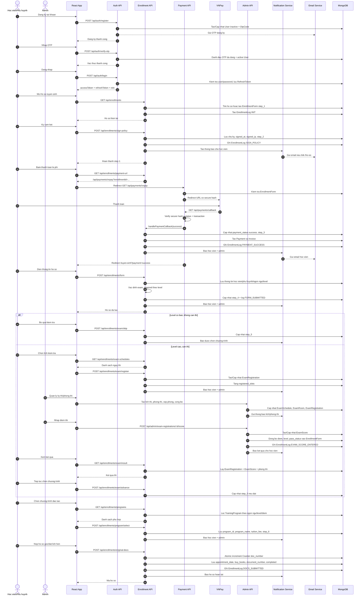
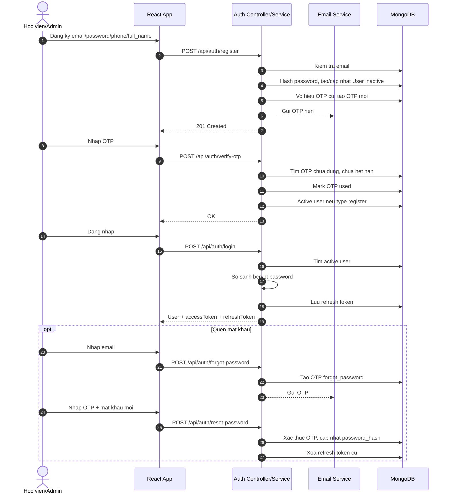
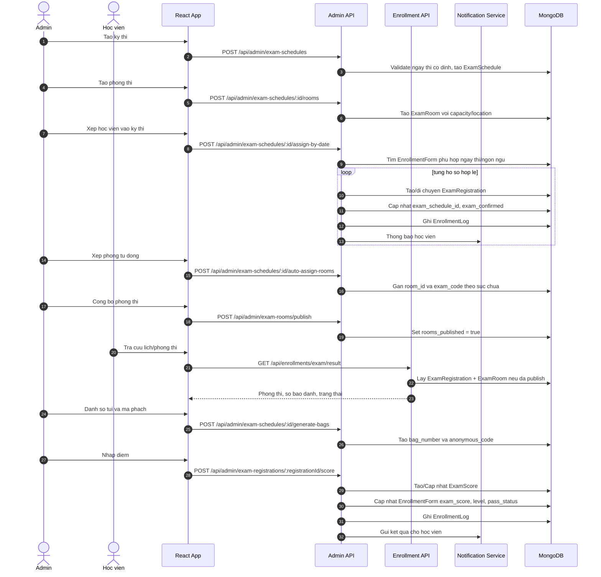
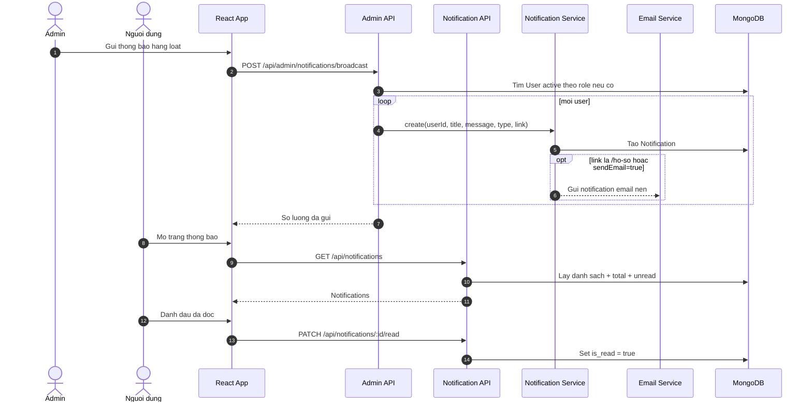
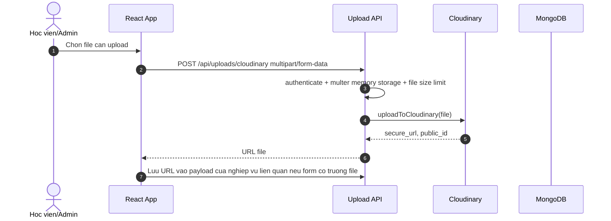

# Use cases va sequence diagram - Edu Enroll

Tai lieu nay tong hop tu source thuc te trong:

- `edu-enroll-app/src/App.tsx`
- `edu-enroll-app/src/services/*.ts`
- `edu-enroll-api/src/index.ts`
- `edu-enroll-api/src/modules/*/*.routes.ts`
- `edu-enroll-api/src/modules/*/*.service.ts`

He thong dang dung React + Express + MongoDB/Mongoose. README goc co nhac MySQL, nhung source hien tai dang ket noi va thao tac qua Mongoose models.

## Actors

- Khach truy cap: xem trang chu, banner, tin tuc cong khai.
- Hoc vien/phu huynh: dang ky, xac thuc OTP, dang nhap, lap ho so tuyen sinh, thanh toan, dang ky thi, xem diem, chon chuong trinh, nop ho so goc, xem thong bao.
- Admin/Super Admin: quan ly dashboard, nguoi dung, ho so, lich thi, phong thi, diem thi, chuong trinh dao tao, phuc khao, phong van, hoa don, banner, tin tuc, cau hinh, import/export CSV.
- VNPay: cong thanh toan le phi ho so.
- Email service: gui OTP va notification email nen.
- Cloudinary: nhan file upload tu nguoi dung/admin.

## Use case list

| Ma | Actor | Use case | API/Man hinh lien quan | Ket qua chinh |
| --- | --- | --- | --- | --- |
| UC01 | Khach | Xem trang chu, banner, tin tuc | `/`, `/api/content/banners`, `/api/content/news` | Hien thi noi dung cong khai da publish |
| UC02 | Hoc vien | Dang ky tai khoan | `/dang-ky`, `POST /api/auth/register` | Tao user chua active, sinh OTP, gui email |
| UC03 | Hoc vien | Xac thuc OTP dang ky | `/xac-thuc-otp`, `POST /api/auth/verify-otp` | Kich hoat tai khoan |
| UC04 | Hoc vien/Admin | Dang nhap | `/dang-nhap`, `POST /api/auth/login` | Nhan access token, refresh token va role |
| UC05 | Hoc vien/Admin | Dang xuat / refresh token | `POST /api/auth/logout`, `POST /api/auth/refresh-token` | Xoa refresh token hoac cap access token moi |
| UC06 | Hoc vien | Quen va doi mat khau bang OTP | `/quen-mat-khau`, `POST /api/auth/forgot-password`, `POST /api/auth/reset-password` | Cap nhat password hash, vo hieu refresh token cu |
| UC07 | Hoc vien | Xem/cap nhat thong tin ca nhan | `/ho-so-ca-nhan`, `GET /api/auth/me`, `PUT /api/auth/profile`, `PUT /api/auth/change-password` | Cap nhat profile hoac mat khau |
| UC08 | Hoc vien | Khoi tao/xem ho so tuyen sinh | `/ho-so`, `GET /api/enrollments` | Tao ho so step 1 neu chua co |
| UC09 | Hoc vien | Ky cam ket/chinh sach | Step 1, `POST /api/enrollments/sign-policy` | Luu chu ky, IP, tang len step 2, tao log/thong bao |
| UC10 | Hoc vien/VNPay | Thanh toan le phi ho so | Step 2, `GET /api/enrollments/payment-url`, `/api/payments/vnpay`, `/api/payments/callback` | Xac nhan thanh toan, tao Payment/Invoice, tang len step 3 |
| UC11 | Hoc vien | Dien ho so tuyen sinh | Step 3, `POST /api/enrollments/form` | Luu thong tin hoc vien/phu huynh/ngon ngu/level; xac dinh co can thi khong |
| UC12 | Hoc vien | Upload file | `POST /api/uploads/cloudinary` | Upload file len Cloudinary va tra ve URL |
| UC13 | Hoc vien | Dang ky lich kiem tra dau vao | Step 4, `GET /api/enrollments/exam-schedules`, `POST /api/enrollments/exam/register` | Tao/cap nhat ExamRegistration, tang registered slots |
| UC14 | Hoc vien | Bo qua thi neu level co ban | Step 4, `POST /api/enrollments/exam/skip` | Tang len step 5 |
| UC15 | Hoc vien | Xem ket qua thi | Step 4, `GET /api/enrollments/exam/result` | Lay diem, level dat, trang thai dau/rot, phong thi neu da publish |
| UC16 | Hoc vien | Chuyen sang buoc chon chuong trinh | `POST /api/enrollments/exam/advance` | Cho phep vao step 5 neu dat dieu kien |
| UC17 | Hoc vien | Chon chuong trinh dao tao | Step 5, `GET /api/enrollments/programs`, `POST /api/enrollments/program/select` | Luu program, hoc phi, tang len step 6 |
| UC18 | Hoc vien | Nop ho so goc/dat lich hen | Step 6, `POST /api/enrollments/original-docs` | Sinh ma ho so bang Counter, danh dau completed |
| UC19 | Hoc vien | Gui va xem phuc khao | `POST /api/enrollments/recheck`, `GET /api/enrollments/recheck` | Tao yeu cau phuc khao |
| UC20 | Hoc vien | Xem/xac nhan phong van | `GET /api/enrollments/interviews`, `POST /api/enrollments/interviews/:id/respond` | Cap nhat trang thai phong van |
| UC21 | Hoc vien | Xem hoa don | `GET /api/enrollments/invoices` | Lay danh sach invoice cua minh |
| UC22 | Hoc vien/Admin | Xem va danh dau thong bao | `/thong-bao`, `GET /api/notifications`, `PATCH /api/notifications/:id/read`, `PATCH /api/notifications/read-all` | Quan ly inbox notification |
| UC23 | Admin | Xem dashboard thong ke | `/quan-tri`, `GET /api/admin/stats` | Tong user, ho so, doanh thu, ho so hoan tat/cho xu ly |
| UC24 | Admin | Quan ly nguoi dung | `/quan-tri/nguoi-dung`, `GET /api/admin/users`, `PATCH /api/admin/users/:id/toggle-active`, `PATCH /api/admin/users/:id/role` | Tim kiem, khoa/mo, doi role |
| UC25 | Admin | Quan ly ho so tuyen sinh | `/quan-tri/ho-so`, `GET /api/admin/enrollments`, `PUT /api/admin/enrollments/:id/status`, `GET /api/admin/enrollments/:id/logs` | Loc/tim, cap nhat status, xem audit log |
| UC26 | Admin | Quan ly lich thi/phong thi | `/quan-tri/ky-thi`, `POST /api/admin/exam-schedules`, `/rooms`, `/auto-assign-rooms`, `/publish`, `/close` | Tao lich, tao phong, xep phong, cong bo phong thi |
| UC27 | Admin | Xep hoc vien vao ky thi | `POST /api/admin/exam-schedules/:id/assign-enrollment`, `POST /api/admin/exam-schedules/:id/assign-by-date` | Tao ExamRegistration, cap nhat ho so, gui thong bao |
| UC28 | Admin | Danh so tui/ma phach | `POST /api/admin/exam-schedules/:id/generate-bags` | Sinh bag number va anonymous code cho thi sinh da xep phong |
| UC29 | Admin | Nhap/luu dong bo diem thi | `/quan-tri/diem-thi`, `POST /api/admin/exam-registrations/:id/score-draft`, `/score`, `/sync-score`, `/sync-scores` | Luu ExamScore, cap nhat EnrollmentForm, gui thong bao |
| UC30 | Admin | Quan ly chuong trinh dao tao | `/quan-tri/chuong-trinh`, CRUD `/api/admin/programs` | Tao/sua/xoa mem chuong trinh |
| UC31 | Admin | Import/export CSV | `/api/admin/import/*`, `/api/admin/export/*` | Nhap/xuat user, program, lich thi, diem thi |
| UC32 | Admin | Gui thong bao hang loat | `/quan-tri/thong-bao`, `POST /api/admin/notifications/broadcast` | Tao notification cho user theo role |
| UC33 | Admin | Xu ly phuc khao | `/quan-tri/phuc-khao`, `GET/PUT /api/admin/rechecks` | Cap nhat trang thai phuc khao va thong bao hoc vien |
| UC34 | Admin | Quan ly phong van | `/quan-tri/phong-van`, `GET/POST/PATCH /api/admin/interviews` | Tao lich phong van, cap nhat trang thai |
| UC35 | Admin | Quan ly hoa don | `/quan-tri/hoa-don`, `GET/PATCH /api/admin/invoices` | Xem va cap nhat status hoa don |
| UC36 | Admin | Quan ly banner/tin tuc/cau hinh | `/quan-tri/noi-dung`, `/api/admin/banners`, `/api/admin/news`, `/api/admin/configs` | Cap nhat noi dung cong khai va cau hinh he thong |

## Use case chi tiet cho cac luong lon

Bang tren la muc tong quan. Cac use case duoi day tach nho nhung luong lon de dung khi giao vien yeu cau moi chuc nang con co use case rieng.

| Ma con | Thuoc UC | Actor | Use case con | Endpoint/man hinh |
| --- | --- | --- | --- | --- |
| UC03.1 | UC03 | Hoc vien | Nhap OTP xac thuc dang ky | `POST /api/auth/verify-otp` |
| UC03.2 | UC03 | Hoc vien | Gui lai OTP dang ky | `POST /api/auth/resend-otp` |
| UC05.1 | UC05 | Hoc vien/Admin | Dang xuat | `POST /api/auth/logout` |
| UC05.2 | UC05 | Hoc vien/Admin | Lam moi access token | `POST /api/auth/refresh-token` |
| UC06.1 | UC06 | Hoc vien | Yeu cau OTP quen mat khau | `POST /api/auth/forgot-password` |
| UC06.2 | UC06 | Hoc vien | Doi mat khau bang OTP | `POST /api/auth/reset-password` |
| UC07.1 | UC07 | Hoc vien | Xem thong tin ca nhan | `GET /api/auth/me` |
| UC07.2 | UC07 | Hoc vien | Cap nhat ho ten/so dien thoai | `PUT /api/auth/profile` |
| UC07.3 | UC07 | Hoc vien | Doi mat khau khi da dang nhap | `PUT /api/auth/change-password` |
| UC10.1 | UC10 | Hoc vien | Lay URL thanh toan | `GET /api/enrollments/payment-url` |
| UC10.2 | UC10 | He thong | Tao request VNPay va redirect | `GET /api/payments/vnpay` |
| UC10.3 | UC10 | VNPay | Callback ket qua thanh toan | `GET /api/payments/callback` |
| UC10.4 | UC10 | He thong | Verify secure hash/trang thai giao dich | Payment controller |
| UC10.5 | UC10 | He thong | Cap nhat Payment/Invoice/Enrollment | Enrollment service |
| UC10.6 | UC10 | He thong | Thanh toan mock khi test | `GET /api/payments/mock-vnpay` |
| UC11.1 | UC11 | Hoc vien | Nhap thong tin hoc vien | Step 3 form |
| UC11.2 | UC11 | Hoc vien | Nhap thong tin phu huynh | Step 3 form |
| UC11.3 | UC11 | Hoc vien | Chon ngon ngu/level/ca hoc/co so | Step 3 form |
| UC11.4 | UC11 | He thong | Xac dinh co can thi dau vao | Enrollment service |
| UC13.1 | UC13 | Hoc vien | Xem danh sach ngay/lich thi | `GET /api/enrollments/exam-schedules` |
| UC13.2 | UC13 | Hoc vien | Dang ky lich thi | `POST /api/enrollments/exam/register` |
| UC13.3 | UC13 | Hoc vien | Doi lich thi khi chua co diem | `POST /api/enrollments/exam/register` |
| UC15.1 | UC15 | Hoc vien | Xem diem/level/pass status | `GET /api/enrollments/exam/result` |
| UC15.2 | UC15 | Hoc vien | Xem phong thi/so bao danh khi da cong bo | `GET /api/enrollments/exam/result` |
| UC18.1 | UC18 | Hoc vien | Chon ngay hen nop ho so goc | Step 6 form |
| UC18.2 | UC18 | Hoc vien | Chon mua sach/ghi chu | Step 6 form |
| UC18.3 | UC18 | He thong | Sinh ma ho so bang Counter | `POST /api/enrollments/original-docs` |
| UC22.1 | UC22 | Hoc vien/Admin | Xem danh sach thong bao | `GET /api/notifications` |
| UC22.2 | UC22 | Hoc vien/Admin | Xem so thong bao chua doc | `GET /api/notifications/unread-count` |
| UC22.3 | UC22 | Hoc vien/Admin | Danh dau mot thong bao da doc | `PATCH /api/notifications/:id/read` |
| UC22.4 | UC22 | Hoc vien/Admin | Danh dau tat ca da doc | `PATCH /api/notifications/read-all` |
| UC24.1 | UC24 | Admin | Xem/tim kiem danh sach nguoi dung | `GET /api/admin/users` |
| UC24.2 | UC24 | Admin | Khoa/mo khoa tai khoan | `PATCH /api/admin/users/:id/toggle-active` |
| UC24.3 | UC24 | Admin | Doi role nguoi dung | `PATCH /api/admin/users/:id/role` |
| UC25.1 | UC25 | Admin | Xem/loc/tim kiem ho so | `GET /api/admin/enrollments` |
| UC25.2 | UC25 | Admin | Cap nhat trang thai ho so | `PUT /api/admin/enrollments/:id/status` |
| UC25.3 | UC25 | Admin | Xem lich su chinh sua ho so | `GET /api/admin/enrollments/:id/logs` |
| UC26.1 | UC26 | Admin | Xem danh sach lich thi | `GET /api/admin/exam-schedules` |
| UC26.2 | UC26 | Admin | Tao lich thi | `POST /api/admin/exam-schedules` |
| UC26.3 | UC26 | Admin | Dong lich thi | `POST /api/admin/exam-schedules/:id/close` |
| UC26.4 | UC26 | Admin | Xem danh sach phong thi | `GET /api/admin/exam-schedules/:id/rooms` |
| UC26.5 | UC26 | Admin | Tao phong thi | `POST /api/admin/exam-schedules/:id/rooms` |
| UC26.6 | UC26 | Admin | Xep phong tu dong | `POST /api/admin/exam-schedules/:id/auto-assign-rooms` |
| UC26.7 | UC26 | Admin | Cong bo phong thi | `POST /api/admin/exam-rooms/publish` |
| UC26.8 | UC26 | Admin | Xem ho so du dieu kien xep thi | `GET /api/admin/exam-schedules/:id/eligible-enrollments` |
| UC27.1 | UC27 | Admin | Xep mot hoc vien vao ky thi | `POST /api/admin/exam-schedules/:id/assign-enrollment` |
| UC27.2 | UC27 | Admin | Xep hang loat theo ngay thi | `POST /api/admin/exam-schedules/:id/assign-by-date` |
| UC28.1 | UC28 | Admin | Sinh so tui thi | `POST /api/admin/exam-schedules/:id/generate-bags` |
| UC28.2 | UC28 | Admin | Sinh ma phach/anonymized code | `POST /api/admin/exam-schedules/:id/generate-bags` |
| UC29.1 | UC29 | Admin | Xem danh sach dang ky thi | `GET /api/admin/exam-registrations` |
| UC29.2 | UC29 | Admin | Nhap diem truc tiep | `POST /api/admin/exam-scores` |
| UC29.3 | UC29 | Admin | Luu nhap diem tam | `POST /api/admin/exam-registrations/:registrationId/score-draft` |
| UC29.4 | UC29 | Admin | Dong bo diem mot thi sinh | `POST /api/admin/exam-registrations/:registrationId/sync-score` |
| UC29.5 | UC29 | Admin | Nhap va dong bo diem mot thi sinh | `POST /api/admin/exam-registrations/:registrationId/score` |
| UC29.6 | UC29 | Admin | Dong bo diem theo ky thi | `POST /api/admin/exam-schedules/:id/sync-scores` |
| UC30.1 | UC30 | Admin | Xem danh sach chuong trinh | `GET /api/admin/programs` |
| UC30.2 | UC30 | Admin | Tao chuong trinh | `POST /api/admin/programs` |
| UC30.3 | UC30 | Admin | Cap nhat chuong trinh | `PUT /api/admin/programs/:id` |
| UC30.4 | UC30 | Admin | Xoa mem/vo hieu chuong trinh | `DELETE /api/admin/programs/:id` |
| UC31.1 | UC31 | Admin | Export ho so tuyen sinh | `GET /api/admin/export/enrollments` |
| UC31.2 | UC31 | Admin | Export nguoi dung | `GET /api/admin/export/users` |
| UC31.3 | UC31 | Admin | Export chuong trinh | `GET /api/admin/export/programs` |
| UC31.4 | UC31 | Admin | Export lich thi | `GET /api/admin/export/exam-schedules` |
| UC31.5 | UC31 | Admin | Export diem thi | `GET /api/admin/export/exam-scores` |
| UC31.6 | UC31 | Admin | Import nguoi dung | `POST /api/admin/import/users` |
| UC31.7 | UC31 | Admin | Import chuong trinh | `POST /api/admin/import/programs` |
| UC31.8 | UC31 | Admin | Import lich thi | `POST /api/admin/import/exam-schedules` |
| UC31.9 | UC31 | Admin | Import diem thi | `POST /api/admin/import/exam-scores` |
| UC33.1 | UC33 | Admin | Xem danh sach yeu cau phuc khao | `GET /api/admin/rechecks` |
| UC33.2 | UC33 | Admin | Cap nhat ket qua phuc khao | `PUT /api/admin/rechecks/:id` |
| UC34.1 | UC34 | Admin | Xem danh sach phong van | `GET /api/admin/interviews` |
| UC34.2 | UC34 | Admin | Tao lich phong van | `POST /api/admin/interviews` |
| UC34.3 | UC34 | Admin | Cap nhat trang thai phong van | `PATCH /api/admin/interviews/:id/status` |
| UC35.1 | UC35 | Admin | Xem danh sach hoa don | `GET /api/admin/invoices` |
| UC35.2 | UC35 | Admin | Cap nhat trang thai hoa don | `PATCH /api/admin/invoices/:id/status` |
| UC36.1 | UC36 | Admin | Xem danh sach banner | `GET /api/admin/banners` |
| UC36.2 | UC36 | Admin | Tao banner | `POST /api/admin/banners` |
| UC36.3 | UC36 | Admin | Cap nhat banner | `PUT /api/admin/banners/:id` |
| UC36.4 | UC36 | Admin | Xoa/an banner | `DELETE /api/admin/banners/:id` |
| UC36.5 | UC36 | Admin | Xem danh sach tin tuc | `GET /api/admin/news` |
| UC36.6 | UC36 | Admin | Tao tin tuc | `POST /api/admin/news` |
| UC36.7 | UC36 | Admin | Cap nhat tin tuc | `PUT /api/admin/news/:id` |
| UC36.8 | UC36 | Admin | Luu tru/xoa tin tuc | `DELETE /api/admin/news/:id` |
| UC36.9 | UC36 | Admin | Xem cau hinh he thong | `GET /api/admin/configs` |
| UC36.10 | UC36 | Admin | Tao/cap nhat cau hinh | `POST /api/admin/configs` |

## Sequence diagram tong quan: quy trinh tuyen sinh end-to-end



## Anh use case diagram da render

- Tong hop tat ca use case: `docs/diagrams/06-use-cases-all.png` va `docs/diagrams/06-use-cases-all.svg`
- Nhom hoc vien/phu huynh: `docs/diagrams/07-use-cases-student.png` va `docs/diagrams/07-use-cases-student.svg`
- Nhom admin/super admin: `docs/diagrams/08-use-cases-admin.png` va `docs/diagrams/08-use-cases-admin.svg`
- Chi tiet auth/thanh toan/thong bao: `docs/diagrams/09-use-cases-auth-payment-notification-detail.png` va `.svg`
- Chi tiet ho so tuyen sinh hoc vien: `docs/diagrams/10-use-cases-student-enrollment-detail.png` va `.svg`
- Chi tiet lich thi/phong thi/diem thi admin: `docs/diagrams/11-use-cases-admin-exam-detail.png` va `.svg`
- Chi tiet quan tri nguoi dung/ho so/chuong trinh/CSV/noi dung: `docs/diagrams/12-use-cases-admin-management-detail.png` va `.svg`

## Sequence diagram: authentication



## Sequence diagram: admin quan ly thi va diem



## Sequence diagram: notification va broadcast



## Sequence diagram: upload file



## Cach render ra hinh

### Cach 1: VS Code

1. Cai extension "Markdown Preview Mermaid Support" hoac extension Mermaid bat ky.
2. Mo file nay.
3. Bam Markdown Preview.

### Cach 2: Mermaid Live Editor

1. Mo `https://mermaid.live`.
2. Copy mot khoi code bat dau bang `sequenceDiagram`.
3. Export SVG/PNG.

### Cach 3: Mermaid CLI

Neu may da co Node.js:

```bash
npx -p @mermaid-js/mermaid-cli mmdc -i docs/use-cases-sequence-diagrams.md -o docs/use-cases-sequence-diagrams.svg
```

Neu CLI khong render truc tiep tu Markdown tren may cua ban, tach rieng tung khoi Mermaid vao file `.mmd`, vi du `enrollment-flow.mmd`, roi chay:

```bash
npx -p @mermaid-js/mermaid-cli mmdc -i enrollment-flow.mmd -o enrollment-flow.png
```
